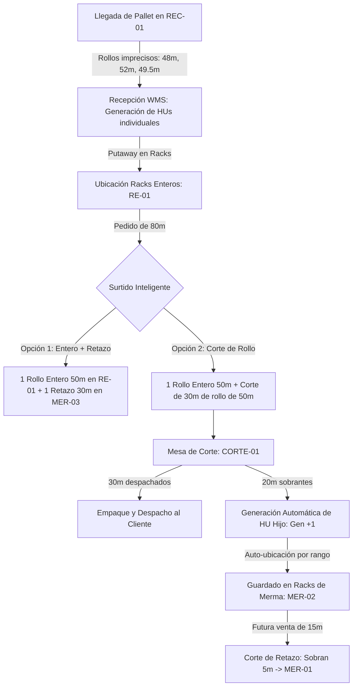

# 🏭 PLAN MAESTRO DE IMPLEMENTACIÓN WMS 360+ — FORMATEX
## Estrategia de Arranque en Frío, Convivencia Operativa y Cero Paros
**Cliente:** FORMA TEXTIL S. DE R.L. DE C.V. (Formatextil) — Guadalajara, Jalisco  
**Consultoría:** Movida TCI  
**Documento para Alineación Directiva y Operativa**  
**Fecha:** Septiembre 2026  

---

## Executive Summary (Resumen Ejecutivo)

Implementar un WMS en una empresa de distribución textil al mayoreo es sustancialmente distinto a cualquier otra industria. A diferencia de abarrotes o refacciones (donde los productos son cajas cerradas con códigos de barras de fabricante), **la tela es un producto continuo y variable**: cada rollo tiene metrajes imprecisos (48m, 51.5m, 62m), se corta continuamente, genera retazos y carece de etiquetas estandarizadas de origen.

La propuesta tradicional de consultores de ERP (como SAP Business One) que exige **"cerrar las puertas 3 días para hacer un inventario general a ciegas y salir de golpe (Big Bang)"** es **inviable y destructiva para Formatex**:
1. Formatex no puede detener sus ventas ni despachos un solo día sin perder clientes frente a la competencia local.
2. Los operadores no tienen cultura previa de escaneo en PDAs ni procesos estandarizados.
3. El almacén cuenta con mercancía en racks, bultos en piso y un "cementerio de retazos" acumulado por meses.

**La solución:** Un plan de **Convivencia Progresiva ("Zona Blanca vs. Zona Gris")** con **Arranque en Frío**, donde la operación comercial y de corte continúa al 100%, mientras un **Champion de Inventario** y la misma inercia de las ventas diarias van digitalizando y ordenando el almacén sin fricción, aprovechando la infraestructura física existente (máquinas revisadoras/enrolladoras en mesas de corte, carros de picking y racks de 6 niveles).

---

## 🔍 Hallazgos Clave de la Inspección Visual del Almacén Real (Nave Atlas)

Tras la revisión fotográfica de las instalaciones actuales de Formatex en Guadalajara, se incorporan al diseño operativo cuatro realidades físicas cruciales:

1. **Racks Industriales de 5 a 6 Niveles (Zonificación Vertical Requerida):**
   * **Niveles 1 y 2 (Piso):** Zona de Picking manual a pie (rollos abiertos, retazos y alta rotación).
   * **Niveles 3 al 6 (Altura):** Zona Buffer/Reserva accesible exclusivamente con montacargas (pallets cerrados y stock de reposición).
2. **Mesas de Corte con Máquinas Enrolladoras Industriales:**
   * La nave cuenta con maquinaria de inspección y enrollado con contadores de metros (rotuladas como `MESA 2`, `MESA 3`, `MESA 5`). En lugar de cortar a ciegas con tijeras, el WMS enviará la orden digital directamente a la pantalla de la máquina asignada.
3. **Carros de Picking con Ruedas ("Burros" Metálicos):**
   * Los operadores cuentan con carros rodantes de 2 y 3 niveles en pasillos, lo que permite implementar **Batch Picking (Surtido por Carro)** para surtir múltiples pedidos en un solo recorrido.
4. **Respeto a la Señalética Existente:**
   * La bodega ya cuenta con rótulos físicos (`PASILLO 1`, `2`, racks `4, 5, 6`). La nomenclatura del WMS adoptará esta misma estructura para no generar confusión en el personal.

---

## 1. El Diagnóstico: Por qué la receta de SAP Business One falla en Textiles

| Criterio | Modelo Teórico SAP B1 | Realidad Formatex (WMS 360+) |
| :--- | :--- | :--- |
| **Naturaleza del Producto** | Discreto y estático (Cajas, Pallets uniformes). | Continuo y variable (Rollos de metraje irregular + retazos). |
| **Etiquetado de Fábrica** | Código EAN/UPC escaneable en cada empaque. | Plásticos transparentes rayados con plumón o notas manuales. |
| **Inicio de Operaciones** | "Big Bang": Paro de 3 a 5 días para conteo general. | **Cero Paros:** Convivencia híbrida progresiva en 4 semanas. |
| **Adopción Tecnológica** | Operadores ya capacitados en procesos rígidos. | Operadores empíricos; se requiere curva suave con Zebra TC22. |
| **Gestión de Sobrantes** | No existe el concepto de "árbol genealógico de corte". | Cada corte divide un rollo padre en pedido + retazo hijo vivo. |

---

## 2. Arquitectura de Transición: "Zona Blanca" vs. "Zona Gris"

Durante las primeras 4 a 6 semanas, el almacén físico y el sistema conviven bajo dos figuras:

```
┌────────────────────────────────────────┐  ┌────────────────────────────────────────┐
│     ZONA GRIS (Almacén Tradicional)    │  │       ZONA BLANCA (WMS Controlado)     │
├────────────────────────────────────────┤  ├────────────────────────────────────────┤
│ • Saldo cargado desde Excel Master.    │  │ • Racks rotulados (Pasillo-Rack-Nivel).│
│ • Ubicación en WMS: ZONA-TRANSICION.   │  │ • Rollos con etiqueta térmica HU.     │
│ • Despacho asistido por memoria/piso.  │  │ • 100% de recepciones de proveedores. │
│ • DISMINUYE con cada venta y corte.    │  │ • Top 20 SKUs inventariados en racks.  │
│                                        │  │ • Retazos clasificados en MER-01/02/03.│
└────────────────────────────────────────┘  └────────────────────────────────────────┘
                    │                                           ▲
                    │                                           │
                    └─────────── INGESTA AL VUELO ──────────────┘
                        (Cada pedido pagado y cada corte
                         convierte tela gris en tela blanca)
```

### La Regla de Oro de Entrada (El Cerrojo)
> **"Toda tela nueva que entra de proveedores entra 100% por WMS a la Zona Blanca."**  
> Nada nuevo se envía a la Zona Gris. De esta manera, el inventario viejo muere naturalmente por ventas y el nuevo nace 100% controlado.

---

## 3. El Dilema de Ventas (ATC): Cotizaciones, Disponibilidad y Reservas

### A. ¿Cómo sabe el vendedor si hay tela si aún no hay HUs individuales?
El saldo del **Excel Master** se migra al WMS como un **Saldo Teórico por SKU** alojado en la ubicación `ZONA-TRANSICION`.
*   El vendedor no tiene que gritar al almacén ni abrir un Excel estático.
*   En la pantalla de cotización, el WMS calcula en 0.1 segundos:
    $$\text{Disponible} = \text{Saldo Físico (HUs + Piso)} - \text{Reservas Blandas Activas} + \text{Tránsito}$$
*   Si hay tela disponible, el vendedor puede cotizar, aplicar listas de precios (F1 a F5) y descuentos de inmediato.

### B. El Candado Anti-Doble Venta (Reserva Blanda de 7 días / 168 horas)
*   En cuanto el vendedor genera la cotización, el WMS **congela los metros cotizados**.
*   Si otro vendedor intenta vender esa misma tela 5 minutos después, el WMS le alerta que ese metraje está reservado.
*   **Auto-expiración:** Si el cliente no paga en 7 días (configurable), la reserva expira sola y los metros regresan a la bolsa disponible. Se acabaron los "apartados eternos" de palabra.

### C. Ventas Combinadas con Tránsito (Backorder / Entregas Parciales)
*   **Caso común:** Cliente pide 150m. Hay 100m en almacén y 50m en un contenedor marítimo que llega en 25 días.
*   El algoritmo `suggest-hus` del WMS detecta la combinación y propone:
    *   **Envío 1 (Inmediato):** 100m físicos.
    *   **Envío 2 (Programado):** 50m del embarque `EMB-2026-XXXX` (ETA en 25 días).
*   El vendedor selecciona `Modo de Entrega: PARCIAL`. Los 50m quedan blindados en el barco para ese cliente.
*   **Cross-Docking en Recepción:** Cuando el camión llega en 25 días y el Champion escanea el contenedor, el sistema dispara:  
    *🔔 "¡Mercancía comprometida! 50m asignados a Pedido PED-XXXX. Apartar en mesa de empaque, no enviar a rack general."*

---

## 4. El "Arranque en Frío" de las Ubicaciones (Evitando la Falsa Ubicación)

> [!CAUTION]
> **Principio de Confianza:** Si a un rollo que viene del Excel le asignamos una ubicación de rack teórica (ej: `RE-01-A-01`) pero físicamente está en otro lado, el picker irá al rack A, no lo encontrará y el sistema perderá credibilidad.

### Reglas de Ubicación en el Arranque en Frío:
1. **Mercancía no inventariada:** Su ubicación en el WMS es estrictamente **`ZONA-TRANSICION` (Piso General)**.
2. **Lo que ve el Picker en su Zebra TC22:**
   * Si el rollo tiene ubicación real de rack:  
     `🟢 RE-01-B-03 · HU-2026-00142 · 50m` ➔ El picker va directo a tiro seguro.
   * Si el rollo está en transición:  
     `🟠 ZONA TRANSICIÓN (Piso General) · SKU: GAB-001` ➔ El picker sabe que debe buscarlo con su método tradicional en piso o preguntar al almacenista, llevarlo a la mesa de corte y vincularlo con **Alta Express**.

---

## 5. El Ciclo de Vida del Rollo Textil: De Pallet a Retazo Mínimo



### A. Llegada de Pallets Imprecisos
* En `POST /api/reception`, cada línea de compra registra la cantidad de rollos y sus metrajes reales.
* El WMS genera 1 código HU único por cada rollo: `HU-2026-XXXXX`.
* Se imprime la etiqueta térmica con código de barras y se pega en el plástico del rollo antes de ingresarlo al rack.

### B. Surtido Multi-Ubicación (Multi-Stop Picking)
Si un cliente pide **80 metros**:
1. El algoritmo del WMS prioriza agotar retazos existentes antes de cortar rollos nuevos para reducir merma.
2. El sistema indica al picker dos paradas en la Zebra:
   * **Parada 1:** `RE-01-A-03` ➔ Tomar rollo entero de 50 metros.
   * **Parada 2:** `MER-03-B-01` ➔ Tomar retazo de 30 metros.
3. El picker escanea ambos códigos HU y los lleva a la mesa de empaque.

### C. Genealogía de Cortes, Flujo del Cortador y Cero Papelitos Post-it ✂️

En la operación actual de Formatex, los cortadores y pickers se comunicaban pegando papelitos post-it manuscritos en los rollos o en los carritos con ruedas. Este vicio operativo generaba confusiones de metraje, telas extraviadas y retazos que nadie sabía de quién eran.

El WMS 360+ transforma este proceso en un **flujo digital de alta velocidad**:

#### 1. Rol Dedicado de CORTADOR (Nivel 4)
* **Ingreso Directo al Puesto de Trabajo:** Al iniciar sesión con credenciales de cortador (ej. `maria.corte`), el sistema detecta su rol y lo redirige automáticamente a su estación de corte móvil (`/zebra/corte` en Zebra TC22 o `/corte` en terminal de mesa), sin pasar por tableros financieros o administrativos que no le competen.
* **Mesa Asignada Persistente:** El cortador fija su estación física (`MESA 1` a `MESA 6`). El sistema recuerda su mesa en memoria local, por lo que cada corte ejecutado queda debidamente firmado y trazado a esa máquina revisadora y a su carrito anexo (`CARRITO 1` o `CARRITO 2`).

#### 2. Corte Guiado y Doble Salida (Hijo + Retazo)
Cuando se corta un rollo madre de 50m para surtir 41m de un pedido:
1. El cortador pistolea el rollo madre o pulsa "Cortar" en la línea asignada del pedido.
2. La máquina revisadora enrolla los 41m exactos verificados por contador mecánico.
3. El cortador confirma el corte en pantalla (`POST /cutting`).
4. **Al instante se generan DOS productos vivos:**
   * **📦 Rollo Hijo (Cliente / Pedido):** Los 41m exactos destinados al cliente (ej. *Boutique Guadalajara*, Pedido `PED-2026-0004`).
   * **✂️ Retazo Nuevo (Inventario Almacén):** Los 9m sobrantes que continúan como activo vivo en inventario bajo un nuevo HU hijo (ej. `HU-2026-00045`), con su ubicación sugerida según la matriz de merma (`MermaRangeConfig`):
     * **MER-01:** Retazos de 1.0m a 5.0m
     * **MER-02:** Retazos de 6.0m a 10.0m
     * **MER-03:** Retazos de 11.0m a 40.0m

#### 3. Impresión Rápida de Ambas Etiquetas (1 Clic) — Adiós al Post-it
Al finalizar el corte, el WMS despliega la tarjeta de doble etiqueta y el botón maestro:
* **⚡ [IMPRIMIR AMBAS ETIQUETAS (RECOMENDADO)]:** En un solo toque genera:
  1. **Etiqueta Morada (Rollo Hijo):** Se pega en el rollo cortado para el cliente con código de pedido, cliente, metros surtidos, mesa, carrito y código QR/barra para que en la estación de Empaque (`/empaque`) se pistolee y se valide en 1 segundo.
  2. **Etiqueta Naranja (Retazo):** Se pega en el rollo sobrante indicando su nuevo HU, metraje remanente (9m) y rack de merma destino.
* También cuenta con botones individuales para reimprimir solo la del cliente o solo la del retazo si se requiere.

### D. Cotización en Frío: Ventas y ATC sin Bloqueo cuando no hay HUs Cargados 💼⚡

Una de las mayores inquietudes en almacenes textiles en transición es: *“¿Qué pasa si la ejecutiva de ventas necesita cotizar una tela que sí está físicamente en el almacén o en piso, pero aún no tiene sus rollos etiquetados con HU en el sistema?”*

El WMS 360+ resuelve este escenario con un **mecanismo de cotización fluida anti-bloqueo**:

1. **Cotización Inmediata con SKU + Precios + Descuentos:**
   * La ejecutiva de ventas / ATC no requiere que existan HUs creados en inventario para levantar la cotización.
   * Selecciona la tela (SKU), captura los metros requeridos, selecciona la **Lista de Precios** comercial (`F1` a `F5`) o precio manual por metro, y aplica el **% de Descuento**.
   * El sistema calcula en tiempo real el precio unitario neto, el importe por línea, el subtotal con descuentos aplicados, el IVA (16%) y el total general en Moneda Nacional.

2. **Semáforo Amigable de Transición (Sin Falsas Alarmas):**
   * En lugar de mostrar un intimidante aviso rojo de *"❌ Sin stock disponible"* que cause pánico o detenga la venta, el componente inteligente despliega:
     `🟠 Mercancía en Transición / Piso · Cotización Habilitada`.
   * Un recuadro informativo aclara a la vendedora: *"Esta tela no tiene rollos (HUs) etiquetados en el sistema en este momento. Puedes cotizar y guardar normalmente con el precio y descuento acordados. Los rollos físicos serán etiquetados o vinculados en tiempo real por el Champion mediante Alta Express o al momento de surtir y cortar."*

3. **Asignación y Amarre Físico al Vuelo:**
   * La cotización se guarda en estado `COTIZADO` con sus importes financieros intactos.
   * En el tablero de pedidos (`/pedidos`), las órdenes que tienen mercancía en piso muestran un distintivo `🟠 En piso`.
   * En el detalle de la orden, cada línea sin rollos pre-asignados cuenta con el botón de acción directa **⚡ Alta Express**. Al pulsarlo, el Champion o el jefe de almacén captura los metros del rollo físico hallado en piso, se genera el código de barras HU, se vincula automáticamente a la línea del pedido y se imprime su etiqueta en la impresora térmica al instante.
   * Alternativamente, el cortador en la mesa de corte puede pistolear cualquier rollo físico de ese SKU y el corte se abona de inmediato al metraje surtido de la línea.

---

## 6. La Figura del "Champion de Inventario": Cómo Vendérselo al Cliente

### El Argumento Financiero para los Socios/Dueño:
> *"Un WMS de última generación no falla por la tecnología; falla cuando en piso nadie es el dueño de la verdad del inventario.  
> Si les pedimos a los mismos cortadores y cargadores que lleven el inventario mientras cargan camionetas a prisa, van a meter datos chuecos y el sistema se caerá en 2 semanas.  
> Designar a **1 persona (Líder / Champion de Inventario)** no es un costo operativo: es la persona que va a frenar las fugas de metros, los retazos perdidos que hoy se pudren en esquinas y las dobles ventas. Su sueldo se paga solo el primer mes con el desperdicio que va a evitar."*

### Rutina Diaria del Champion:
* **08:30 - 10:30 (Recepción):** Recibir proveedores, ingresar remisiones a WMS, imprimir etiquetas de rollos y supervisar putaway en racks.
* **10:30 - 13:00 (Ingesta Pareto 80/20):** Mapear físicamente en racks los 15-20 SKUs más vendidos usando la pantalla de **Alta Express**.
* **14:00 - 16:00 (Ingesta On-the-Fly):** Apoyar a la mesa de corte etiquetando tela no registrada que salió de la Zona Gris para pedidos del día.
* **16:00 - 17:30 (Auditoría de Retazos):** Supervisar que ningún retazo quede sin etiqueta HU y asegurar que regresen a sus racks `MER-01/02/03`.

---

## 7. Herramientas Clave en Software para el Champion

Para que el Champion y el personal operen con agilidad extrema sin burocracia, el WMS 360+ incorpora dos herramientas nativas de alto rendimiento:

### A. "Alta Express de Inventario" (Ingreso Rápido de Rollos)
* **Objetivo:** Ingestar rollos físicos recién identificados en piso o recibidos sin orden previa en menos de 20 segundos.
* **Captura Rápida:** Entrada por lista de metrajes (ej: `50, 48.5, 52, 50, 49`).
* **Acción en 1 Clic:** Genera los Handling Units `HU-YYYY-XXXXX`, registra movimiento tipo `ENTRADA`, y lanza la impresión de etiquetas térmicas.
* **Vinculación Inmediata con Ventas:** Si la tela fue solicitada para un pedido urgente sin stock formal, se vincula al `orderLineId` y se reserva en firme al instante.

### B. "Módulo de Conteo Cíclico" (Auditoría Continua sin Paro de Almacén) 📋
* **Revisión del WMS:** El modelo de datos de Prisma ya contemplaba en sus enumeraciones los tipos `MovementType.CONTEO` y `AlertType.CONTEO_DISCREPANCIA`. Ahora cuentan con una interfaz visual y endpoints dedicados (`/inventario/rollos?tab=cyclic`).
* **Funcionamiento:**
  1. El Champion selecciona una tela (SKU) de su lista de rotación diaria.
  2. El WMS consulta en vivo el **Balance del SKU** (`GET /inventory/sku-balance/:skuId`): Metros físicos en rack, metros reservados y metros teóricos.
  3. El Champion captura los rollos encontrados físicamente en el pasillo o rack.
  4. El sistema compara **Teórico vs. Físico**:
     * Si coincide o hay diferencias menores, ajusta los HUs y registra movimiento `tipo: 'CONTEO'`.
     * Si la discrepancia supera el umbral configurable (ej. > 5.0m), dispara automáticamente una alerta crítica tipo `CONTEO_DISCREPANCIA` para la Gerencia de Almacén.
  5. **Cero Paros:** Los conteos se realizan en bloques de 15 minutos diarios por pasillo; ventas y corte nunca dejan de operar.

---

## 8. Cronograma de Adopción (4 Fases en 6 Semanas — 0 Días de Paro)

```
SEMANA 1          SEMANA 2          SEMANA 3-4        SEMANA 5-6
[ Fase 0 ]        [ Fase 1 ]        [ Fase 2 ]        [ Fase 3 ]
Cimientos         El Cerrojo        Convivencia       Go-Live Pleno
Físicos           y el Pareto       Híbrida           y Cíclicos
```

### Fase 0: Cimientos Físicos (Semana 1)
* Rotular racks y pasillos con códigos de barras (`RE-01-A-01`).
* Instalar estación de etiquetado central (PC + Impresora Térmica).
* Cargar catálogo maestro de SKUs limpio en base de datos.
* Cargar saldos de Excel Master a `ZONA-TRANSICION` para habilitar cotizaciones.

### Fase 1: El Cerrojo y el Pareto (Semana 2)
* **Activación de Compras:** 100% de recepciones de proveedor entran por WMS y se etiquetan.
* **Pareto 80/20:** El Champion mapea y etiqueta los 20 SKUs que generan el 80% de las ventas.
* **Piloto PDA:** Capacitación con 1 solo operador (el más afín a tecnología) en Zebra TC22.

### Fase 2: Convivencia y Surtido Híbrido (Semanas 3 y 4)
* ATC cotiza 100% en WMS con reservas blandas y tránsito.
* Pedidos de Zona Gris se etiquetan al vuelo en mesa de corte con **Alta Express**.
* Se activa la clasificación automática de retazos en `MER-01/02/03`.

### Fase 3: Go-Live Pleno y Conteos Cíclicos (Semanas 5 y 6)
* La Zona Gris se reduce a menos del 10% del inventario.
* Todos los pickers y cortadores operan formalmente con Zebra TC22.
* Se apaga el Excel Master definitivamente.
* Se establece la rutina de **conteos cíclicos** (15 minutos diarios por pasillo).

---

## 9. Guion para la Reunión de Mañana con los Directivos de Formatex

### Pregunta típica del cliente:
> *"¿Por qué no paramos un fin de semana y contamos todo para arrancar de cero con el sistema al 100%?"*

### Tu respuesta estratégica:
> *"Porque en rollos de tela eso es una trampa. En un fin de semana con prisas van a contar metros aproximados, van a dejar retazos sin medir y el lunes van a descubrir que el sistema dice 50 metros donde hay 40. Además, ustedes no pueden dejar de vender ni arriesgar el servicio a sus clientes.  
> Nuestro método es quirúrgico: ponemos un cerrojo en la puerta para que nada nuevo entre sin control, blindamos los 20 productos que les dan el 80% de su dinero, y usamos las ventas del día a día para que el almacén se limpie solo. En 4 semanas tienen un almacén de clase mundial sin haber perdido un solo peso en ventas."*
